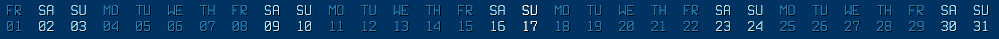

# horical

Horizontally formatted text calendar for conky

## Sample Output

On Sunday 17 January 2021, the output would look like this:

```
FR  ${color1}SA${color}  ${color1}SU${color}  MO  TU  WE  TH  FR  ${color1}SA${color}  ${color1}SU${color}  MO  TU  WE  TH  FR  ${color1}SA${color}  ${color0}SU${color}  MO  TU  WE  TH  FR  ${color1}SA${color}  ${color1}SU${color}  MO  TU  WE  TH  FR  ${color1}SA${color}  ${color1}SU${color}
01  ${color1}02${color}  ${color1}03${color}  04  05  06  07  08  ${color1}09${color}  ${color1}10${color}  11  12  13  14  15  ${color1}16${color}  ${color0}17${color}  18  19  20  21  22  ${color1}23${color}  ${color1}24${color}  25  26  27  28  29  ${color1}30${color}  ${color1}31${color}
```

Depending on your conky settings for `default_color` (`color`), `color0`, `color1`, and `font` conky will display something like this:



## Notes

In your `.conkyrc`, you will need the following expression in the `conky.text = [[...]]` section:

```
${eval ${exec /path/to/executable}}
```

The following variables must be set in your `.conkyrc`:

- `color0`: today's color
- `color1`: the weekend color
- `default_color`: the color of all the other days
- `font`: should be set to a monospace font in order to maintain proper alignment of the weekdays and the dates

### [example `.conkyrc`](horical.conkyrc)
